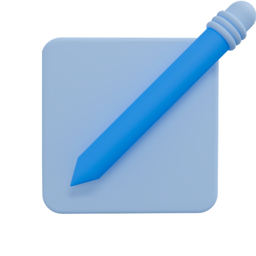

  

<h1 align="center">F L O T E S</h1>

Looking for a simple note app with no crazy features? Something simple to just jot down stuff? That's what Flotes is. An Android-focused app written with Flutter framework and using Firebase's authentication and Firestore as its database. Simply sign-in with Google and start syncing your notes. BUT HOLD UP!

**DISCLAIMER!** Notes are not encrypted in any way. They will be stored raw on the server. At least till I add encryption feature. So becareful!

## Intentions Behind Flotes
This project is only an entry point to the app development world. So expect to find unnecessary widget composition or grossly glued together code (which works!). Although I did my best to write as cleanly as possible.

## Installation
App is not and neither intended to be published on APK distribution platforms like Play Store and etc. Thererfor, installation is manually carried out by running: `flutter run` in the project's main directory.

## Contribution
Feel free to provide any contribution, but for clearance, this project is just a showcase of skills.

## Attributions
Logo is provided by [Dicky Prayudawanto](https://iconscout.com/contributors/dickpra)